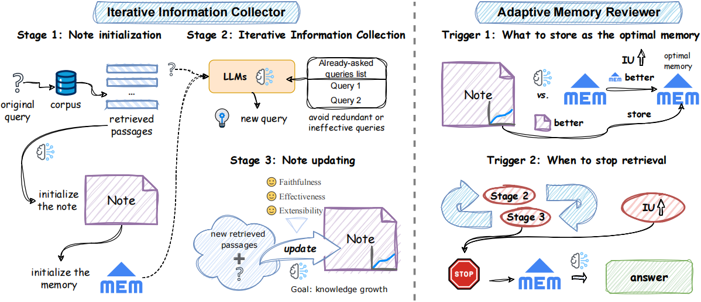

<h1 align="center">
    Retriever-and-Memory: Towards Adaptive Note-Enhanced Retrieval-Augmented Generation
</h1>
We propose a generic RAG approach called Adaptive Note-
Enhanced RAG (Adaptive-Note) for complex QA tasks,
which includes the iterative information collector, adaptive
memory reviewer, and task-oriented generator, while fol-
lowing a new Retriever-and-Memory paradigm. 



# Prepare Datasets

Please create a `data/` directory and place all the corpus and evaluation files within it. All experimental datasets can be found [here](https://drive.google.com/drive/folders/11EGpumXoMVpnBsiR5xeLGDD3Z8ikBdVT?usp=drive_link). For the ASQA corpus, please download it separately from [this link](https://dl.fbaipublicfiles.com/dpr/wikipedia_split/psgs_w100.tsv.gz) due to its large size.

# Retrieval Services

We offer three retrieval services as detailed in our paper:

1. **BM25 Retrieval Service** using ElasticSearch for 2WikiMQA, MuSiQue, and HotpotQA.
2. **BGE Retrieval Service** using FAISS for CRUD.
3. **GTR Retrieval Service** using FAISS for ASQA.

## Prepare Services for BM25

First, install Elasticsearch 7.10 using the following commands:

```bash
wget https://artifacts.elastic.co/downloads/elasticsearch/elasticsearch-7.10.2-linux-x86_64.tar.gz
wget https://artifacts.elastic.co/downloads/elasticsearch/elasticsearch-7.10.2-linux-x86_64.tar.gz.sha512
shasum -a 512 -c elasticsearch-7.10.2-linux-x86_64.tar.gz.sha512
tar -xzf elasticsearch-7.10.2-linux-x86_64.tar.gz
cd elasticsearch-7.10.2/
./bin/elasticsearch # Start the server
pkill -f elasticsearch # To stop the server
```

## Indexing Corpora for the Datasets

### Build indices for 2WikiMQA, MuSiQue, and HotpotQA:

```bash
cd src/build_index/es

# 2WikiMQA
python index_2wiki.py

# MuSiQue
python index_musique.py

# HotpotQA
python index_hotpotqa.py
```

### ASQA Indexing

Our corpus and retrieval settings follow [ALCE](https://github.com/princeton-nlp/ALCE.git). Since generating GTR embeddings is resource-intensive, you can download them and place them in `data/corpus/asqa/` as follows:

```bash
wget https://huggingface.co/datasets/princeton-nlp/gtr-t5-xxl-wikipedia-psgs_w100-index/resolve/main/gtr_wikipedia_index.pkl
```

Build the index:
```bash
cd src/build_index/emb
python index.py --dataset asqa --model gtr-t5-xxl
```

### CRUD Indexing

Build the index for CRUD:
```bash
cd src/build_index/emb
python index.py --dataset crud --model bge-base-zh-v1.5 --chunk_size 512
```

# Configuration

You can configure your API key, URL, and other settings in the `./config/config.yaml` file.

# Running Note and Evaluation

To run and evaluate for 2WikiMQA, MuSiQue, HotpotQA, and ASQA:
```bash
python main.py --method note --retrieve_top_k 5 --dataset asqa --max_step 3 --max_fail_step 1 --MaxClients 10 --model gpt-3.5-turbo-0125 --device cuda:0 
```
The predicted results and evaluation metrics (F1 and EM) will be automatically saved in the `output/{dataset}/{method}/{model}` directory. The evaluation results can be found at the end of the file.

For CRUD (crud_1doc, crud_2doc, crud_3doc):
```bash
python main.py --method note --retrieve_top_k 2 --dataset crud_1doc --max_step 3 --max_fail_step 1 --MaxClients 10 --model gpt-3.5-turbo-0125 --device cuda:0 
```
The predicted results will be automatically saved in the `output/{dataset}/{method}/{model}` directory.

## Evaluating CRUD

We follow [CRUD-RAG](https://github.com/IAAR-Shanghai/CRUD_RAG.git) and use the RAGQuestEval metric, which relies on GPT. Run the following code to perform the evaluation:

```bash
python metrics_questeval_crud.py --eval_path {saved predict file}
```

The evaluation results will be automatically saved in the `output/{dataset}/{method}/{model}/metric_questeval` directory.